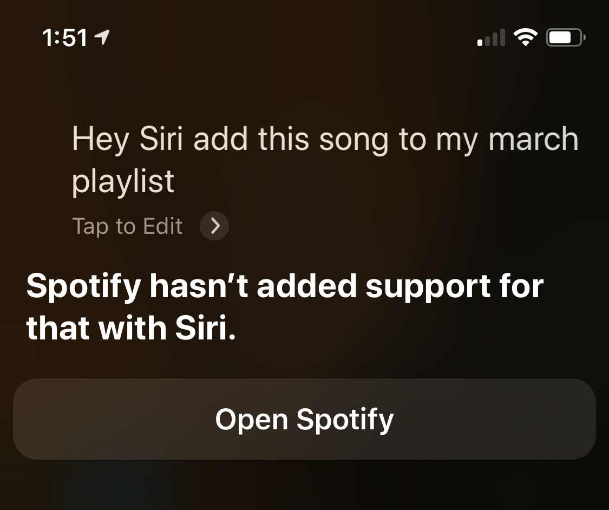
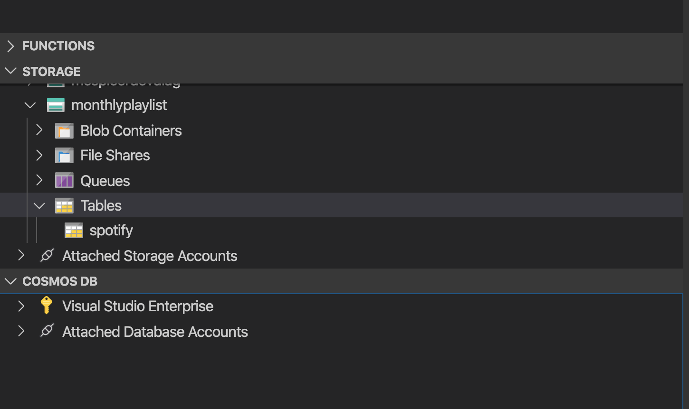
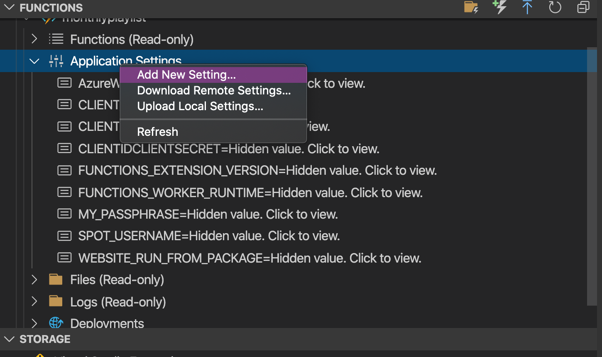
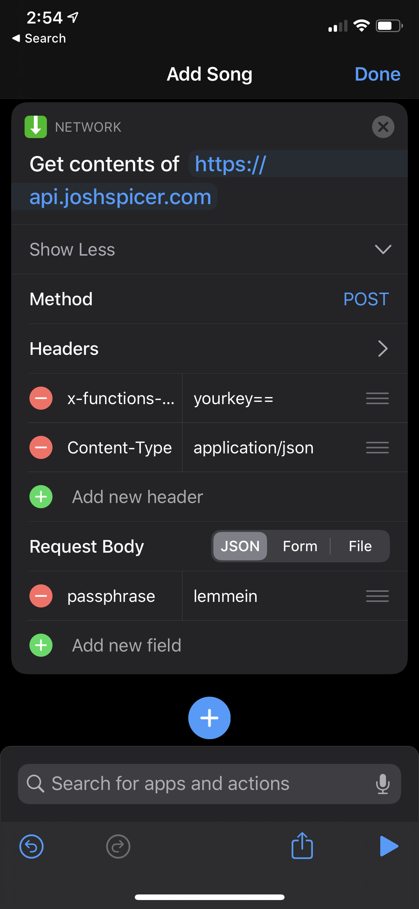
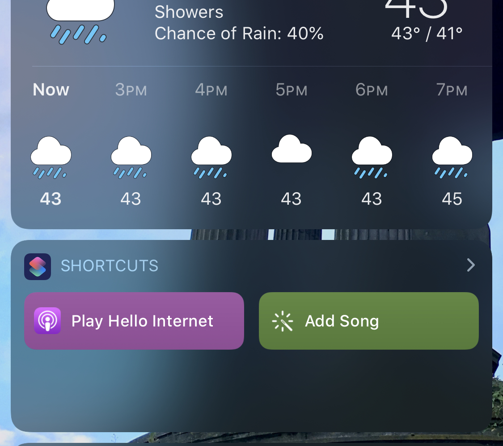

> *“Hey Siri - add this song to my monthly playlist!"*
>
> 
>
> Not helpful...

For a long time i've found it inconvenient that, in order to add songs to a playlist I need to, (1) unlock my phone, (2) open Spotify, (3) usually navigate through 4 pages of menus, (4) sift through (an unsearchable) list of playlists, and (5) tap on the right playlist.

I want there to be a better way to add songs to my "monthly" playlist. As you'll see in this guide I decided to leverage a Siri Shortcut to trigger a simple Azure Function, dropping the current track into the right playlist with _only one tap_.

I offer two modes:

If you submit a simple POST, it will execute the function and add my currently playing song to the previously defined "monthly" playlist.

```bash
curl -X POST \
-d '{"passphrase":"letmein"}' \
-H "Content-Type: application/json" \
http://localhost:7071/api/playlist
```

You can also specify a playlist ID, we will store that ID in the function's state. All future song POSTs will be placed into this playlist. It assumes you have write access to the provided playlist.

```bash
curl -X POST \
-d '{"passphrase":"letmeinplzz", \
			"playlist": "0OBq0h6EjCmaPXjeCB4IlM"}' \
-H "Content-Type: application/json" \
http://localhost:7071/api/playlist
```

Playlist IDs are easily found by "sharing" a song or playlist from the Spotify app. This is all [documented](https://developer.spotify.com/documentation/web-api/reference/object-model/) by Spotify.

All of the code referenced below can be found on [github](https://github.com/joshspicer/MonthlyPlaylistAzureFunction).

## Setup

I wanted to try out Azure functions - which is very similar to AWS Lambda (which i've used before for a [bunch of similar Spotify tools](/spotify-now-playing)).

Conveniently, everything can be almost completely configured through VS Code.

I followed the [Azure Project in VS Code Quickstart](https://docs.microsoft.com/en-us/azure/azure-functions/functions-create-first-function-vs-code?pivots=programming-language-csharp) docs. I chose C# for this project.

Make sure you also install the appropriate VS Code Azure extensions: [Azure Functions](https://marketplace.visualstudio.com/items?itemName=ms-azuretools.vscode-azurefunctions) and [Azure Storage](https://marketplace.visualstudio.com/items?itemName=ms-azuretools.vscode-azurestorage).

Also have node installed and pull various azure core tools.

```bash
npm install -g azure-functions-core-tools;
dotnet add package Microsoft.Azure.WebJobs.Extensions.Storage --version 3.0.4
```

With the guide above you should get a quick Hello World running locally! You'll be able to debug right from VS Code, and eventually push your function up right from the IDE.


## Storage

> **Note**: I've already gone over the Spotify authentication flow in my [previous guides](/spotify-now-playing), so I won't be going over any of that in this guide. We're going to use the same concept to read my now playing data and write it to a playlist.

There's a couple key pieces of persistent data we need. For that we're going to store it in an Azure data table. You can create a table right in Visual Studio by navigating to the Azure symbol on the sidebar.



In the function code you'll see me binding a table named `spotify` in the signature of the `Run()` method:

```c#
public static async Task<IActionResult> Run(
            [HttpTrigger(AuthorizationLevel.Function, "post", Route = null)] HttpRequest req,
            [Table("spotify")] CloudTable cTable,
            ILogger _log)
```

We're also going to take advantage of some environment variables. You can set those in VS as well.



They can be accessed in code with this method.

```c#
/// Get an environment variable
public static string GetEnvironmentVariable(string name)
{
    return System.Environment.GetEnvironmentVariable(nameEnvironmentVariableTarget.Process);
}
```

## Dynamic binding

I had a bit of a time trying to understand how to write to an Azure table at runtime. A lot of the Microsoft docs for [storage table](https://docs.microsoft.com/en-us/azure/azure-functions/functions-bindings-storage-table?tabs=csharp) expect you to declaratively bind with attributes for data I/O.

I eventually found the `Microsoft.WindowsAzure.Storage.Table` namespace which gave me access to `CloudTable`.

I could then do read and write operations like below. My table schema is defined by `SpotifyDetails`.

```c#

public class SpotifyDetails : TableEntity
{
    // PartitionKey and RowKey implied.
    public string AccessToken { get; set; }
    public string RefreshTokenLeft { get; set; }
    public string RefreshTokenRight { get; set; }
    public DateTime ExpiresAt { get; set; }
    public string MonthlyPlaylistId { get; set; }
}

/// Read Operation
public static async Task<SpotifyDetails> GetSpotify(CloudTable cTable)
{
    TableOperation retrieve = TableOperation.Retrieve<SpotifyDetails>("1", "0");
    var result = await cTable.ExecuteAsync(retrieve)
    return ((SpotifyDetails)result.Result);
}

/// Update Operation
public static async Task UpdateMonthlyPlaylist(CloudTable cTable, string playlistId)
{
    SpotifyDetails sCreds = new SpotifyDetails()
    {
        PartitionKey = "1",
        RowKey = "0",
        MonthlyPlaylistId = playlistId,
    };
    await cTable.ExecuteAsync(TableOperation.InsertOrMerge(sCreds));
}

```

If you aren't familiar with async programming in C#, check out the [best practices here](https://docs.microsoft.com/en-us/archive/msdn-magazine/2013/march/async-await-best-practices-in-asynchronous-programming).

## Gotchas

I found that some strings, namely the Spotify refresh token, were both too long and contained invalid characters for the Azure environment variable container. This wasn't completely evident from the VS code extension.


## Deploying and Function Keys

Deploying is just a click away in VS Code!

### Function keys

I didn't realize this until I deployed, but by default, functions are also protected by an azure-level authorization token.

> Azure Functions allows you to protect access to your HTTP triggered functions by means of [authorization keys](https://docs.microsoft.com/en-us/azure/azure-functions/functions-bindings-http-webhook#authorization-keys) . For each function you can choose an "authorization level". anonymous means no API key is required, function means a function specific API key is required. So in this case each function has its own keys. And admin means you are required to provide the special “master” host key, which is a single key that can be used to call any function in your function app.
> To call a protected function you either provide the key as a query string parameter (in the form code=<API_KEY>) or you can provide it as a HTTP x-functions-key header
>
> **(credit: [Managing Azure Functions Keys](https://markheath.net/post/managing-azure-function-keys))**

Add in that header like so.

```bash
curl -X POST \
-d '{"passphrase":"letmeinnowww"}' \
-H "Content-Type: application/json" \
-H "x-functions-key:<your-key>" \
'http://mymonthplaylist.azurewebsites.net/api/mymonthplaylist'

```

## Siri Shortcuts

Create a new Shortcut with the action `Web Request -> Get Contents`. I set mine up like so:



With this shortcut set up you can now quickly add music a ton of different ways, for example via Siri or a Widget.



I also set up another shortcut to parse a playlist URI from my clipboard, and POST that in the body to reset the monthly playlist. Running that whenever I make a new playlist is quick and easy.
